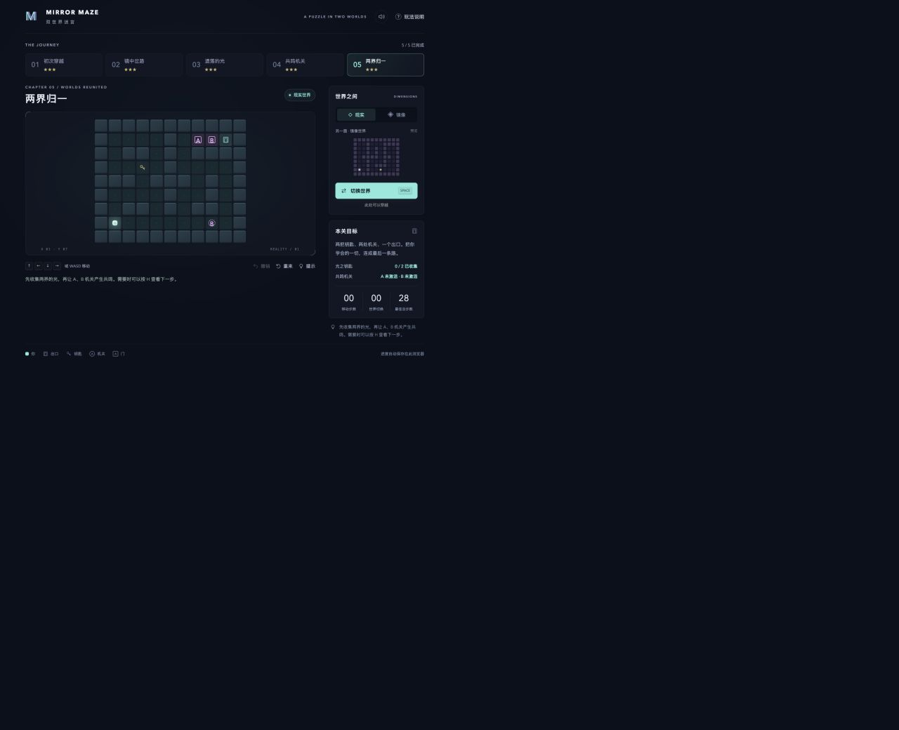

# Mirror Maze · 双世界迷宫

一个以「同一坐标、两个世界」为核心机制的单人解谜小游戏。使用原生 JavaScript、HTML 和 CSS 编写，**没有第三方运行或构建依赖**，适合课程展示、算法讲解和二次开发。

玩家在现实与镜像中移动，借助不同的道路布局，收集钥匙、激活跨界机关，最终到达出口。现实使用青色、镜像使用紫色；桌面右侧可预览另一世界。



## 快速运行

需要 Node.js 22 或更新版本。克隆仓库后运行：

```bash
npm start
```

在浏览器打开 **http://127.0.0.1:4173**。没有 npm 依赖需要安装，也不需要账号、API 密钥或网络资源。

也可以使用 Python 3，在项目目录运行 `python3 -m http.server 4173 --bind 127.0.0.1`。请通过 HTTP 打开游戏，直接双击 HTML 文件可能受到 ES 模块的浏览器安全限制。

## 操作

| 操作                | 按键          |
| ------------------- | ------------- |
| 移动                | 方向键 / WASD |
| 切换世界            | 空格          |
| 撤销一步            | Z             |
| 重玩当前关卡        | R             |
| 最短路线下一步提示  | H             |
| 关闭说明 / 成绩弹窗 | Esc           |

手机尺寸提供方向按钮与切换按钮。键盘焦点在按钮上时，空格和 Enter 保留按钮的标准激活行为；点击地图或执行移动后恢复游戏按键。

## 玩法与关卡

- 两个世界共享坐标。另一面对应位置是墙或未开启的门时，不能切换。
- 走到钥匙上自动收集，钥匙随玩家跨世界携带。收齐本关全部钥匙才能通关。
- 圆形 `A / B` 是机关，方形 `A / B` 是门。机关激活后，两个世界同名的门永久开启。
- 每次有效移动和切换各计 1 步，撞墙不计步。撤销恢复上一状态与步数。
- 达到最短总步数为 3 星，不超过最短步数的 1.5 倍（向上取整）为 2 星，其余通关为 1 星。提示使用次数单独记录，不降低星级。
- 关卡逐个解锁，可以重玩已解锁关卡。最佳成绩、已完成关卡、音效设置保存在当前浏览器的 `localStorage`；未完成的一局刷新后重新开始。不会跨设备同步。

| 关卡        | 主题                   | 最短总步数 |
| ----------- | ---------------------- | ---------- |
| 01 初次穿越 | 学习切换世界           | 14         |
| 02 镜中岔路 | 多次交替穿越           | 16         |
| 03 遗落的光 | 跨界收集钥匙           | 14         |
| 04 共鸣机关 | 机关与门联动           | 18         |
| 05 两界归一 | 双钥匙、双机关综合挑战 | 28         |

## 验证与构建

```bash
npm test       # 25 项自动化测试
npm run build  # 生成 dist/ 纯静态文件
npm run check  # 测试 + 构建
npm run preview  # 在默认端口预览 dist/，先停止 npm start
```

通过 `PORT=4180 npm run preview` 可指定其他本地端口。开发服务只监听 `127.0.0.1`。

测试覆盖碰撞、钥匙、跨界机关、门、出口限制、最短路径、星级、存档校验与最优成绩。对每一关穷举可达状态，并通过反向图搜索确认全部状态都能到达出口，避免玩家陷入只能重开的死局。GitHub Actions 会在 `main` 推送与 PR 时执行测试和构建。

浏览器实际验证情况见 [验证记录](docs/VALIDATION.md)。构建产物可以部署到支持静态文件的服务；此仓库不自动发布站点。

## 项目结构

```text
index.html             页面结构、开始菜单与弹窗
src/
  app.js               输入处理、渲染、音效、流程协调
  engine.js            纯函数游戏规则与 BFS 求解器
  levels.js            五个关卡的数据定义
  storage.js           本地存档与记录校验
  styles.css           双世界主题、动效、响应式布局
scripts/
  serve.mjs            本地静态服务
  build.mjs            构建静态产物
tests/                 Node.js 内置测试
docs/                  课程 proposal、技术设计与验证记录
```

## 课程资料

- [项目 Proposal](docs/PROPOSAL.md)：背景、目标、功能范围、验收标准。
- [技术设计](docs/DESIGN.md)：状态建模、搜索算法、模块划分、扩展关卡方法。
- [验证记录](docs/VALIDATION.md)：自动化测试范围和浏览器验收结果。

当前版本专注于五个手工设计关卡。关卡编辑器和随机生成器可作为后续课程扩展。
